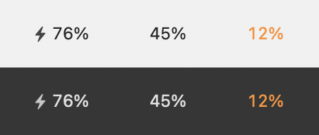

# Mini Battery Menu

A macOS menu bar battery indicator that is just the number. No capsule icon, no
wasted width.



## Why

The built in battery item spends most of its width on a picture of a battery
that tells you roughly what the percentage next to it already said precisely.
On a laptop with a notch, menu bar space runs out and macOS silently drops
whichever items do not fit. This gives the percentage back and returns the rest
of the space.

## What it shows

- **The percentage.** Monospaced digits, so it does not shuffle as the number
  changes.
- **A filled bolt while charging.** A hollow bolt when the power is connected
  but the battery is being held short of full, which is what optimised charging
  does. Nothing at all when running on battery, because that is the normal case
  and it does not need an icon.
- **Colour when it matters.** Amber at 20% or below, red at 10% or below, both
  only when unplugged.

Click it for time until full or empty, capacity against the original design
capacity, cycle count and battery condition. Open at Login and Compact Spacing
are in the same menu.

**Compact Spacing** tightens the padding inside the item. macOS owns the gap
*between* status items and no app can change that, so the padding within one is
the only width there is to give back. On a full menu bar, macOS silently drops
whichever items do not fit, so a few points can be the difference between
seeing an item and not.

To remove the item, quit the app from its menu.

Command dragging it off the bar is deliberately not enabled. That needs
`NSStatusItemBehaviorRemovalAllowed`, which does not merely permit the user to
remove the item, it permits the *system* to, and on a menu bar with no free
room macOS takes that permission within seconds of launch.

## Hiding the built in one

System Settings, then Control Center, then Battery, and turn off **Show in Menu
Bar**. The percentage stays available in Control Center either way.

## Requirements

macOS 14 or later, and the Xcode Command Line Tools:

```bash
xcode-select --install
```

## Build and install

```bash
git clone https://github.com/atLayf/mini-battery-menu.git
cd mini-battery-menu
./build.sh
```

That compiles a release build, assembles the app, ad hoc signs it, installs it
to `/Applications` (or `~/Applications` if that is not writable) and launches
it. Use `./build.sh --no-install` to build without installing.

Ad hoc signed rather than notarised, which is why there is no download here.
Building from source keeps Gatekeeper out of the way.

## How it reads the battery

Live values (percentage, charging state, time remaining) come from the IOKit
power source snapshot, which also posts a notification the moment anything
changes, so the item updates when the plug moves rather than on a poll. Cycle
count, condition and capacity against design come from the `AppleSmartBattery`
entry in the IO registry. A sixty second timer is a backstop for the percentage
drifting down with no event to announce it.

## Licence

MIT. See [LICENSE](LICENSE).
